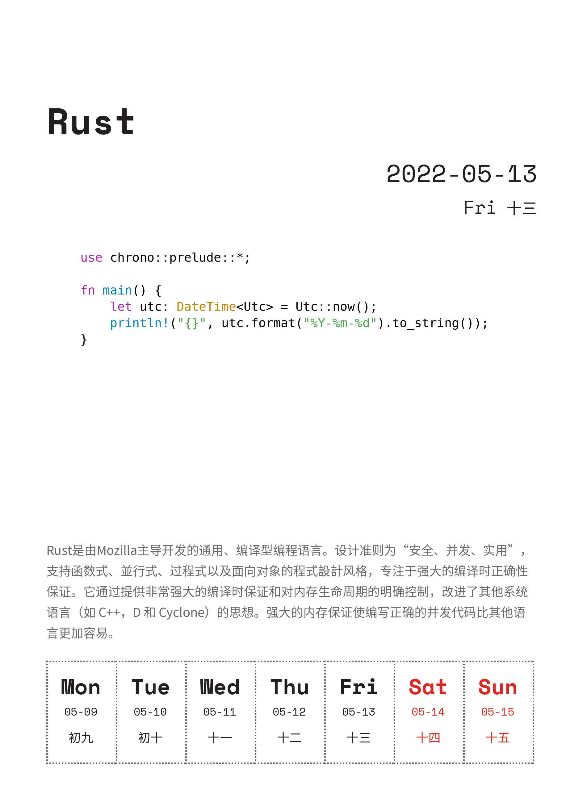

# TuringCalendarGenerator
生成自定义内容的 [编程日历](https://www.ituring.com.cn/book/details/2625) （图灵教育），图像由纯代码生成，无需准备图片资源。
<p align="center"> 
    <h3 align="center">编程日历生成器</h3>
    <p align="center">轻松生成自定义日历，并合成至壁纸。</p>
</p>

<center>
    
    
    
</center>

# 示例
[ASM](images/asm.png) / [Rust](images/rust.png) / [Lisp](images/lisp.png)

# 开始使用
## 安装依赖
[pillow]()：图像处理  
[lunar-python]()：获取农历中文日期以及节日信息  
[pygments]()：生成代码高亮图
```commandline
pip install pillow lunar-python pygments
```
## 修改 pygments 使其支持透明通道
修改 `<your_python_packages_path>/pygments/formatters/img.py` 中 `ImageFormatter` 的 `format` 方法，将第 576 行 `RGB` 改为 `RGBA`
```python
im = Image.new(
    'RGBA',  # 修改此处
    self._get_image_size(self.maxlinelength, self.maxlineno),
    self.background_color
)
```
有考虑编写无需改库的代码，但在此之前，**这步是必要的**。   

## 编辑配置文件
修改配置文件：[config.py](config.py)
```python
today = datetime.today()  # 日期，datetime 类型
title_text = ''  # 标题
description_text = ''''''  # 介绍语
code = ''''''  # 代码块
language = 'python'  # 代码块的语言，填 None 自动识别
filename = 'output.png'  # 输出文件名
```
也可修改字体、颜色、位置等，详细见 [config.py](config.py) 注释

一些已经编写好的配置文件可供参考：[example](example)

## 运行
```commandline
python main.py
```

# 相关项目

[zhihaozhang/TuringCalendar](https://github.com/zhihaozhang/TuringCalendar)

[ttttmr/2018_code_calendar_wallpaper](https://github.com/ttttmr/2018_code_calendar_wallpaper)
