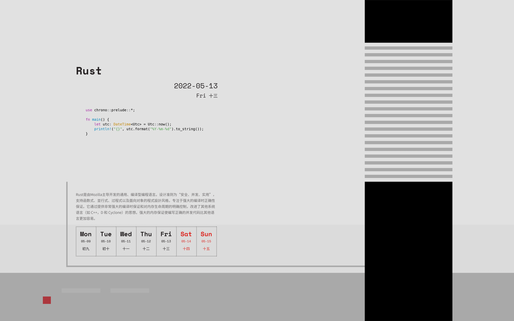

# TuringCalendarGenerator
生成自定义内容的 [编程日历](https://www.ituring.com.cn/book/details/2625) （图灵教育），图像由纯代码生成，无需准备图片资源。  


<p align="center"> 
    <h3 align="center">编程日历生成器</h3>
    <p align="center">轻松生成自定义日历，并合成至壁纸。</p>
</p>

<div align="center">
    
    
</div>

# 示例
日历：[ASM](images/asm.png) / [Rust](images/rust.png) / [Lisp](images/lisp.png)  
壁纸：[ASM](images/wallpaper_asm.png) / [Rust](images/wallpaper_rust.png) / [Lisp](images/wallpaper_lisp.png)

# 开始使用
## 安装依赖
[pillow]()：图像处理  
[lunar-python]()：获取农历中文日期以及节日信息  
[pygments]()：生成代码高亮图
```commandline
pip install pillow lunar-python pygments
```
## 修改 pygments 使其支持透明通道
修改 `<your_python_packages_path>/pygments/formatters/img.py` 中 `ImageFormatter` 的 `format` 方法，将第 576 行 `RGB` 改为 `RGBA`
```python
im = Image.new(
    'RGBA',  # 修改此处
    self._get_image_size(self.maxlinelength, self.maxlineno),
    self.background_color
)
```
有考虑编写无需改库的代码，但在此之前，**这步是必要的**。   

## 编辑配置文件
修改配置文件：[config.toml](config.toml)
```toml
[calendar]
today = "today"  # today 意味着使用 datetime.today()，也就是当日
# today = "2022-05-12"  # 像这样的格式去指定日期也是可以的
title = "这里是标题"
description = """在这里，你可以写多行的介绍语
但要注意手动换行排版
"""
code = """print('这里是代码块')
print('同样的，注意换行和缩进，可能影响排版')
"""
language = "python"
output = "output/calendar.png"

[wallpaper]
input = "images/wallpaper.png"
code_zoom = 0.5
code_pos = [50, 100]
output = "output/wallpaper.png"
```
也可修改字体、颜色、位置等，详细见 [config.toml](config.toml) 注释

一些已经编写好的配置文件可供参考：[example](example)

## 运行
```commandline
$ python main.py --help
Usage: main.py [OPTIONS] COMMAND [ARGS]...

Options:
  --help  Show this message and exit.

Commands:
  calendar
  wallpaper
```
只有两个命令，`calendar` 和 `wallpaper`，两者都可以使用 `-c` 或者 `--config` 指定配置文件路径，不指定默认为 `config.toml`

### 生成日历
使用 `calendar` 命令可以生成日历图片
```commandline
$ python main.py calendar -c config.toml 
```
默认底色为纯白，通过 `--transparent` 参数可以设置为透明背景
```commandline
$ python main.py calendar -c config.toml --transparent
```
### 合并壁纸
使用 `wallpaper` 可以将透明背景的日历图片合并至指定壁纸
```commandline
$ python main.py wallpaper -c config.toml
```
### 运行示例
生成日历：
```commandline
$ python main.py calendar -c example/rust.toml

日历已保存至 output/rust.png
```
生成并合并至壁纸  

*注意：* 这里不需要先执行上一步，会自动生成一个背景透明背景的图片并输出合并后的文件
```commandline
$ python main.py wallpaper -c example/rust.toml

壁纸已保存至 output/wallpaper_rust.png
```
# 相关项目

[zhihaozhang/TuringCalendar](https://github.com/zhihaozhang/TuringCalendar)

[ttttmr/2018_code_calendar_wallpaper](https://github.com/ttttmr/2018_code_calendar_wallpaper)
